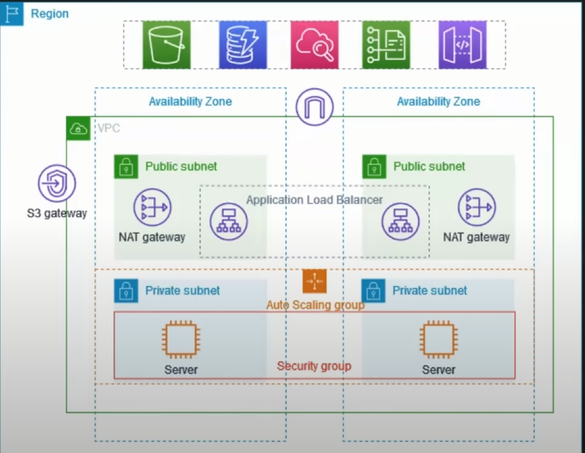
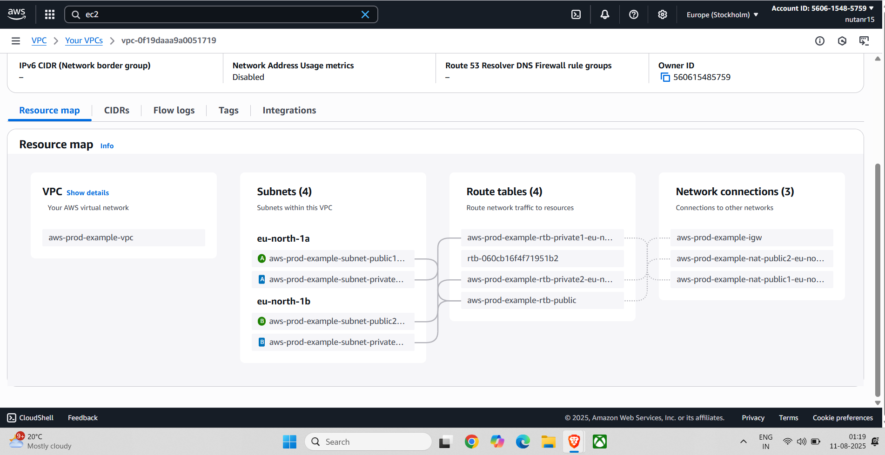
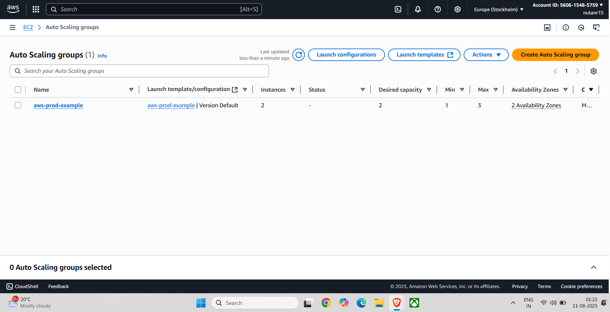
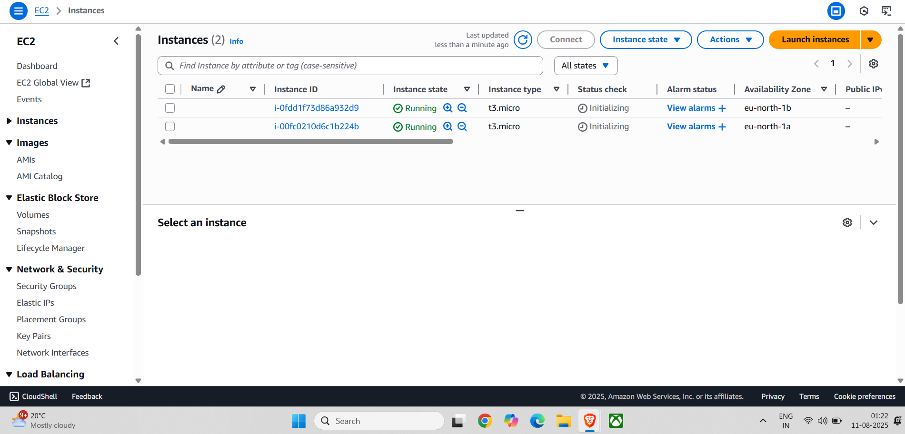
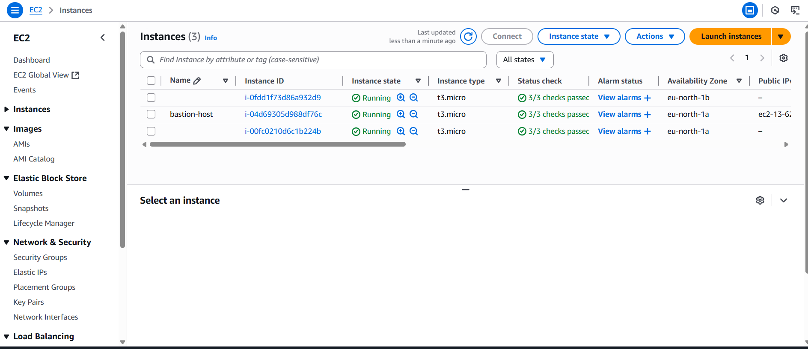
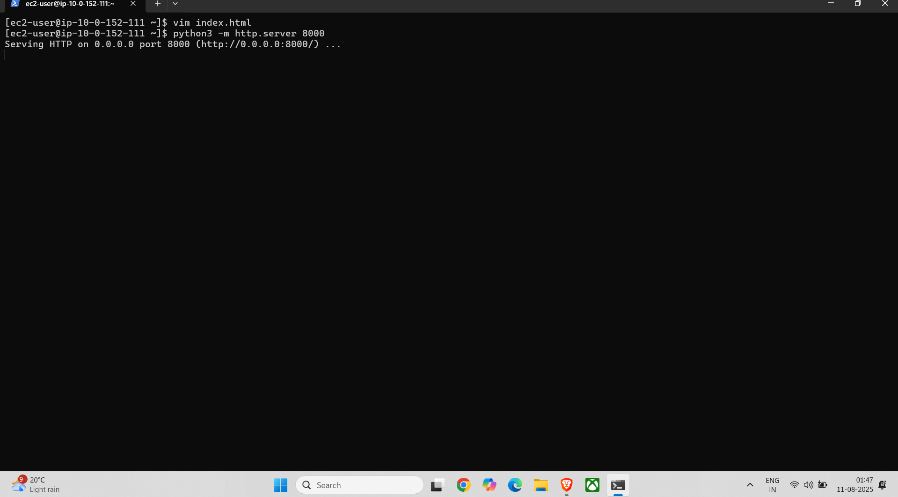
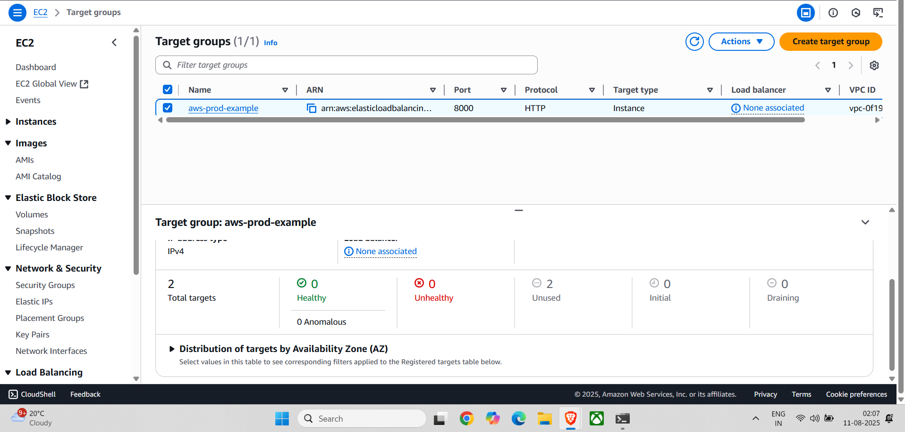
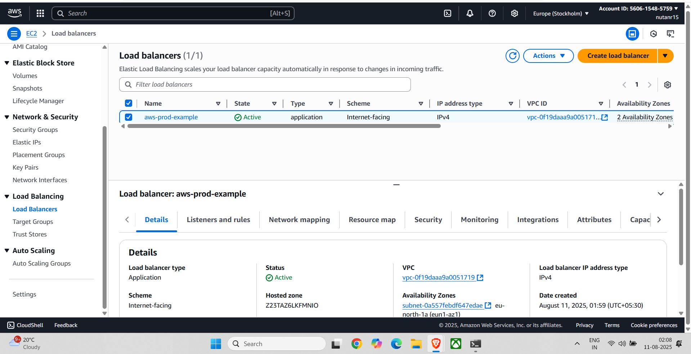
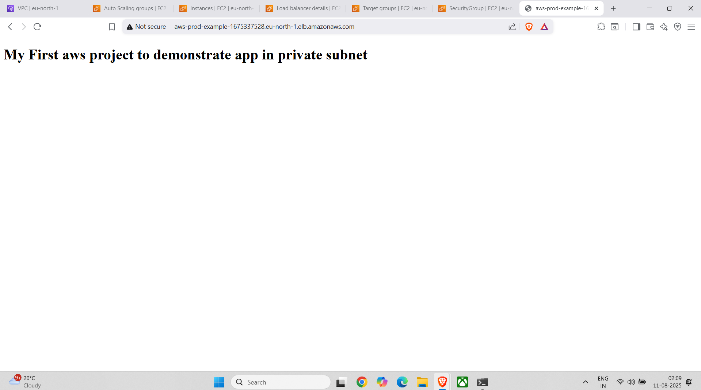

# End-to-End AWS VPC Project

## Overview

This project demonstrates the complete setup of a secure and scalable AWS environment using VPC, EC2, Auto Scaling, load balancing, and best-practice networking and security. The app is deployed in a private subnet and made accessible via an Application Load Balancer.

---

## Architecture Diagram



---

## Step-by-Step Implementation

### 1. VPC and Networking Setup
- Custom VPC, public/private subnets, route tables, and NAT gateways.
- See screenshot:  
  

### 2. Auto Scaling Group
- Created an Auto Scaling Group spanning multiple AZs.
- See screenshot:  
  

### 3. EC2 Instances
- EC2 instances launched in private subnets via Auto Scaling.
- See screenshot:  
  

### 4. Bastion Host
- Deployed a bastion host in a public subnet for secure SSH access to private EC2 instances.
- Accessed the private instance and ran a Python web app on port 8000.
- See screenshots:  
    
  

### 5. Target Group & Load Balancer
- Created target group for the web app (port 8000).
- Set up an Application Load Balancer and attached the target group.
- See screenshots:  
    
  

### 6. Application Access via Load Balancer
- App is accessible from the public internet via the ALB DNS name.
- See screenshot:  
  

---

## Security Best Practices

- Security Groups and NACLs restrict traffic to only what is needed.
- Bastion host used for SSH access; private keys are securely stored.
- IAM roles and policies restrict instance permissions.

---

## Sample Application

A simple static HTML file (`index.html`) is served using Python's built-in HTTP server on port 8000.

```html
<!-- app/index.html -->
<!DOCTYPE html>
<html>
<body>
<h1>My First aws project to demonstrate app in private subnet</h1>
</body>
</html>
```

**To run the app on your private EC2 instance:**
```sh
python3 -m http.server 8000
```

---

## How to Reproduce

1. Follow the screenshots and steps above in your AWS account.
2. Upload the sample `index.html` to your EC2 instance.
3. Start the HTTP server with:
    ```sh
    python3 -m http.server 8000
    ```
4. Configure your security groups, IAM roles, and route tables as illustrated.

---

## Images

All referenced screenshots are in the `images/` directory.

---

## License

MIT License
