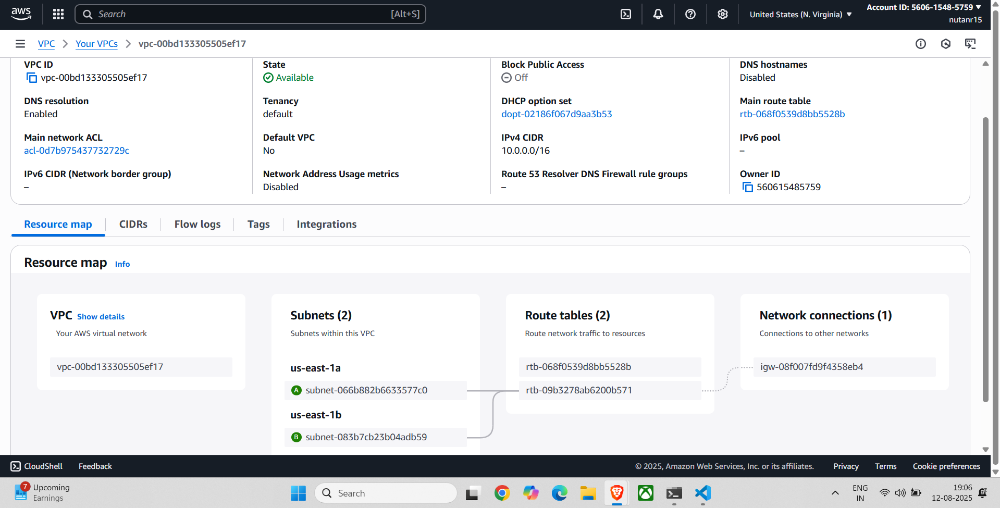
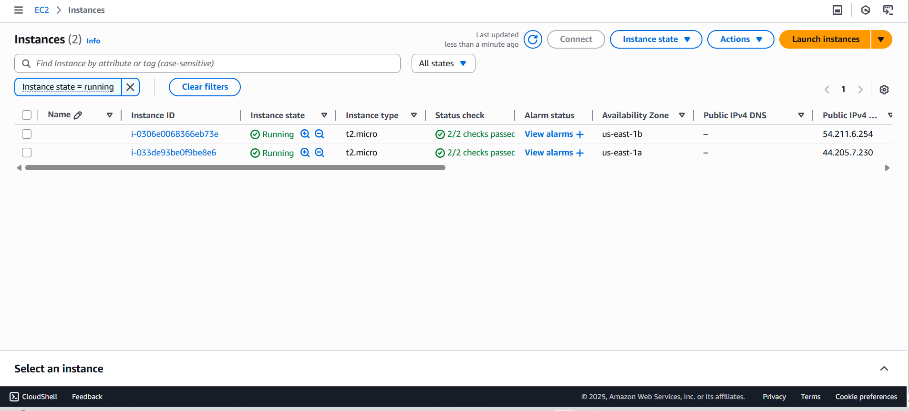
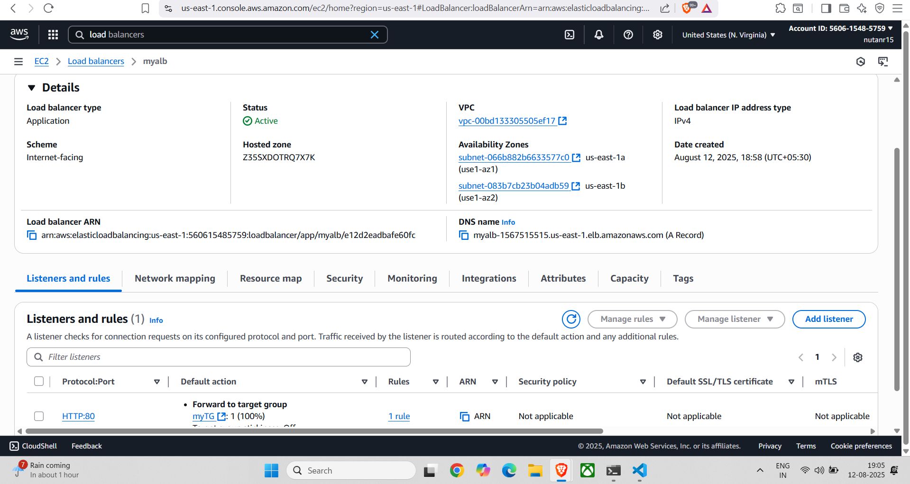
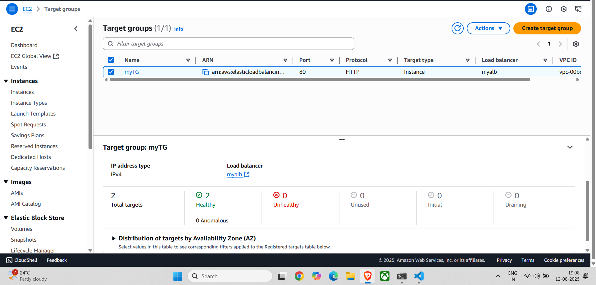
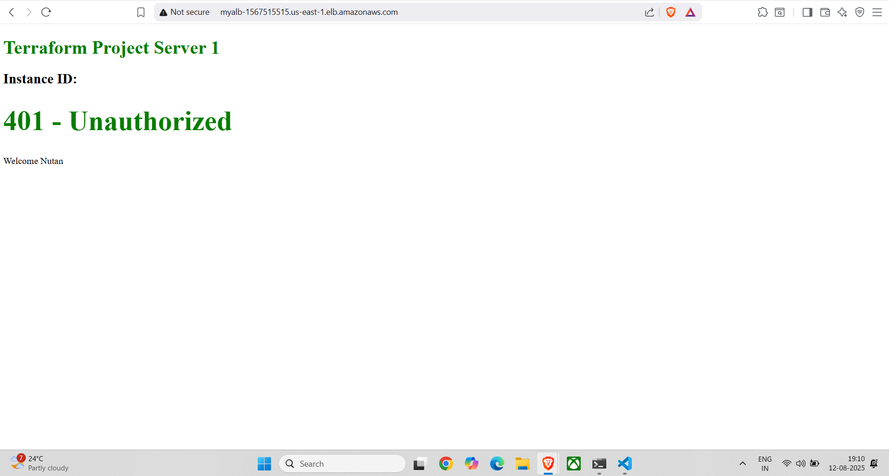
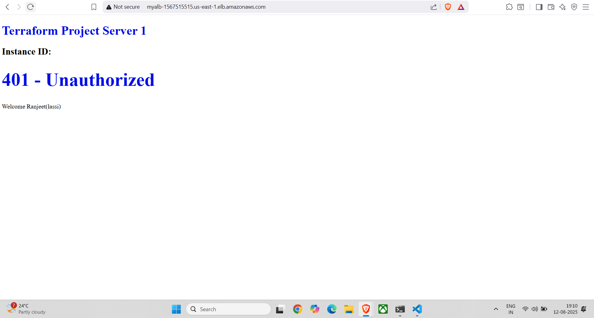

# AWS Infrastructure with Terraform – VPC, EC2, and Load Balancer

  
*Figure 1: Overall architecture of the deployed AWS infrastructure using Terraform. This includes a VPC, two public subnets in different Availability Zones, EC2 instances (each with unique user data scripts), an Application Load Balancer, and an S3 bucket.*

---

## 📌 Project Overview

This project provisions AWS infrastructure using Terraform to deploy:

- **Custom VPC** with public subnets in multiple Availability Zones  
- **Internet Gateway & Route Table** to allow public access  
- **Two EC2 web servers** (each running a unique `user_data` script for differentiation)  
- **Application Load Balancer (ALB)** to distribute incoming HTTP requests  
- **S3 Bucket** for basic storage  
- **Security Group** allowing HTTP and SSH access  
- Output of the ALB DNS for testing

The setup demonstrates **real-time load balancing**: when the ALB DNS is accessed in the browser and refreshed, the page alternates between two different outputs—proving requests are served by both EC2 instances.

---

## 🏗️ Architecture Components

- **VPC & Networking**
  - CIDR: `var.cidr` (e.g., `10.0.0.0/16`)
  - Two public subnets (`us-east-1a` & `us-east-1b`)
  - Internet Gateway & Public Route Table
- **Compute**
  - 2 × t2.micro EC2 Instances (AMI: ubuntu 20.04 example)
  - Custom `user_data` scripts per instance
- **Load Balancing**
  - Internet-facing ALB across both subnets
  - Target group with health checks on port 80
- **Security**
  - Security Group allowing HTTP(80) & SSH(22) from anywhere *(not secure for production)*
- **Storage**
  - S3 bucket: `nutanterraform25project`

---

---

## 🚀 Step-by-Step Deployment

### **1. Configure AWS Provider**
`provider.tf`

### **2. Provision Infrastructure**

#### **Step 1: Create VPC & Subnets**
  
Public subnets in different AZs ensure high availability.

#### **Step 2: Create Internet Gateway & Route Table**  
Allows internet connectivity for public-facing resources.

#### **Step 3: Create Security Group**
Allows inbound HTTP (80) and SSH (22).

#### **Step 4: Launch EC2 Instances**

- **Server 1:** Runs `userdata.sh`
- **Server 2:** Runs `userdata1.sh`

#### **Step 5: Create Application Load Balancer**
  
Distributes incoming HTTP requests between both servers.

#### **Step 6: Configure Target Group**
  
Both EC2 instances are healthy and registered as targets.

---

## 🧪 Testing Load Balancer

After `terraform apply`, you’ll see output:

**Steps:**
1. Open ALB DNS URL in your browser.
2. Refresh several times.
3. Observe alternating outputs.

---

### Expected Pages:

**Server 1 Output**  
  

**Server 2 Output**  
  

This confirms the ALB is working and routing requests.

